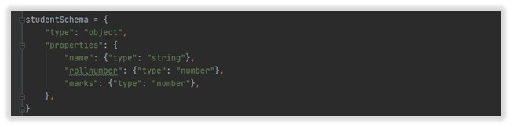
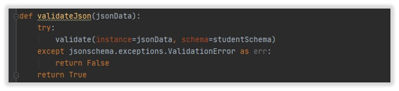
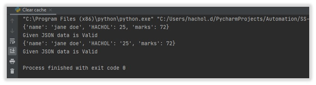

##jsonschema.validate() 

การติดต่อสื่อสารระหว่าง Application จำเป็นต้องพิจารณาให้ความสำคัญในทุก ๆจุดที่มีการ Interface เชื่อมโยงหรือส่งข้อมูลระหว่างกัน เนื่องจากหากไม่มีการตรวจสอบข้อมูลทีส่งระหว่างกัน อาจจะกลายเป็นช่องโหว่ของ Application ที่ส่งผลกระทบต่อระบบการทำงานของระบบโดยรวม ตัวอย่างเช่นการใช้ API สื่อสารกันระหว่าง Application ด้วยตัวแปร JSON ซึ่งในกรณีนี้ผู้เขียนจะยกตัวอย่างการลดความเสี่ยงจากการส่งข้อมูล JSON ที่ผิดพลาดจากส่งข้อมูล ตัวแปร JSON  โดยการตรวจสอบความถูกต้องข้อมูลฟังก์ชัน jsonschema.validate()

##การประยุกต์ใช้งาน Function
1) เริ่มต้นจากการกำหนดรูปแบบ json schema 

2) สร้าง Function เพื่อรับค่ามา Validate กับ json schema ที่กำหนดไว้เพื่อตรวจสอบความถูกต้องของข้อมูลระหว่างกัน

3)นำตัวแปรเพื่อเปรียบเทียบเทียบพร้อมนำผลลัพท์มาใช้งาน

4)หลักจากการตรวจสอบรูปแบบของตัวแปร JSON จะแสดงค่า output ซึ่งตรวจเจอ ตัวแปร JSON ที่รับเข้ามา 2 ครั้งซึ่งครั้งที่ 2 จะเป็นรูปแบบ json schema ที่ผิดพลาดซึ่งสามารถตรวจสอบได้จาก jsonschema.validate() 

ฟังก์ชั่น jsonschema.validate() สามารถใช้ในการตรวจสอบข้อมูลที่มีการส่งระหว่าง Application ช่วยลดความ
ผิดพลาดที่เกิดขึ้นในระหว่างการรับส่งข้อมูล 

